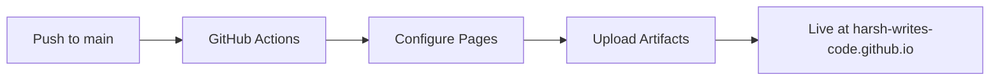

<div align="center">

  # ⚡ Harsh Dhiman — Backend Software Engineer

  <p align="center">
    <strong>Crafting scalable backend architectures, high-performance APIs, and robust databases.</strong>
  </p>

  <p align="center">
    <a href="https://harsh-writes-code.github.io"></a>
    <a href="https://www.linkedin.com/in/harsh-dhiman-barara"></a>
    <a href="https://x.com/HarshDhimanc"></a>
    <a href="mailto:harshdhimanbarara15@gmail.com"></a>
  </p>

  <p align="center">
    
    
    
    
  </p>

</div>

---

## 🌟 About The Portfolio

This repository hosts the official personal portfolio of **Harsh Dhiman**, designed to highlight technical expertise in backend engineering, systems design, and full-stack development with a modern, high-performance web experience.

### ✨ Highlights & Capabilities
- 🚀 **Buttery Smooth Interactions:** Powered by GSAP ScrollTrigger, SplitText, and Lenis smooth scrolling.
- 📱 **Fully Responsive:** Optimized across ultra-wide monitors, laptops, tablets, and smartphones.
- ⚡ **Zero-Latency Static Hosting:** Deployed on GitHub Pages with instant asset delivery.
- 🎨 **Minimal & Modern Aesthetic:** Dark-mode focused UI with clean typography and dynamic SVG micro-interactions.

---

## 🛠️ Tech Stack & Skills

<div align="center">

### Backend & Architecture


### Databases & Caching


### Cloud & DevOps


### Frontend & Animations


</div>

---

## 📂 Repository Structure

```ascii
harsh-writes-code.github.io/
├── .github/
│   └── workflows/
│       └── deploy.yml        # Automated CI/CD pipeline for GitHub Pages
├── Harsh.png                 # Profile image asset
├── robot-avatar.svg          # Avatar graphic
├── index.html                # Main production portfolio page
├── LICENSE                   # Open-source MIT License
└── README.md                 # Repository documentation
```

---

## 🚀 Deployment Workflow

Every push to the `main` branch triggers an automated GitHub Actions pipeline that publishes the static assets directly to **GitHub Pages**:



---

## 🤝 Let's Connect!

I am always open to discussing backend architectures, engineering opportunities, or collaborating on exciting projects.

<p align="center">
  <a href="mailto:harshdhimanbarara15@gmail.com">
    
  </a>
  &nbsp;
  <a href="https://www.linkedin.com/in/harsh-dhiman-barara">
    
  </a>
</p>

---

<div align="center">
  <sub>Built with ❤️ by <a href="https://github.com/harsh-writes-code">Harsh Dhiman</a>. Released under the <a href="LICENSE">MIT License</a>.</sub>
</div>
